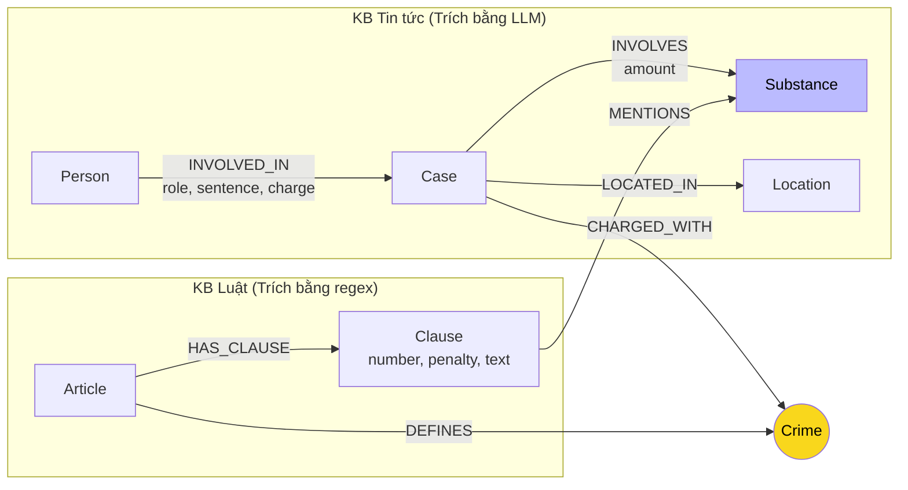

# Thiết kế Ontology — Day 19

**Họ tên:** Trần Tuấn Hoàng  **MSSV:** 2A202602832

**Lựa chọn** (đánh dấu một):
- [x] Dùng ontology gợi ý (có thể chỉnh nhỏ)
- [ ] Tự thiết kế (xét bonus +15, xem `SUBMISSION.md`)

> Hướng dẫn: `LAB_GUIDE.md` Bước 2. Dùng ontology gợi ý thì vẫn phải điền đủ các mục dưới đây bằng lời của bạn.

## 1. Sơ đồ

Sơ đồ mô hình dữ liệu Knowledge Graph nối hai cơ sở tri thức: **KB Luật** (`data/drug_law/`) và **KB Tin tức** (`data/drug_news/`). Node cầu nối trung tâm là **`Crime` (Tội danh)**:

- **Node cầu nối chính:** `Crime` (màu vàng) — kết nối vụ án (`Case`) ở KB Tin tức với Điều luật (`Article`) ở KB Luật.
- **Node dùng chung:** `Substance` (màu xanh) — vừa được nhắc trong các khoản luật (`MENTIONS`), vừa được thu giữ trong các vụ án thực tế (`INVOLVES`).

---

## 2. Entity types (node labels)

| Label | Ý nghĩa | Khóa định danh (`MERGE` theo) | Properties | Lấy từ KB nào | Trích bằng (regex / LLM / khác) |
| --- | --- | --- | --- | --- | --- |
| `Article` | Đại diện cho một Điều luật trong BLHS hoặc Luật PCMT | `id` (ví dụ: `"Điều 251 BLHS"`) | `id`, `title`, `law`, `doc_id` | KB Luật | regex (từ metadata front-matter và tiêu đề) |
| `Clause` | Đại diện cho một Khoản trong Điều luật | `id` (ví dụ: `"Điều 251 BLHS khoản 1"`) | `id`, `number`, `penalty`, `text`, `doc_id` | KB Luật | regex (`CLAUSE_START`, `penalty` pattern) |
| `Crime` | Tội danh chuẩn hóa (node cầu nối giữa 2 KB) | `name` (chuẩn hóa chữ thường, ví dụ: `"mua bán trái phép chất ma túy"`) | `name` | KB Luật (được map từ Tin tức) | regex (từ tiêu đề Điều) + hàm `normalize_crime` |
| `Substance` | Chất ma túy hoặc tiền chất | `name` (tên chuẩn, ví dụ: `"MDMA"`, `"Heroine"`) | `name` | Cả hai KB | Danh mục `SUBSTANCES` chuẩn + string search / LLM |
| `Case` | Vụ án / vụ việc cụ thể được báo chí đưa tin | `name` (tên vụ do LLM tóm tắt) | `name`, `summary`, `date`, `doc_id`, `source_title` | KB Tin tức | LLM (JSON mode) |
| `Person` | Cá nhân liên quan (bị cáo, bị can, đối tượng) | `name` (họ và tên) | `name`, `aliases` (danh sách biệt danh) | KB Tin tức | LLM (JSON mode) |
| `Location` | Tỉnh / thành phố nơi xảy ra hoặc xét xử vụ việc | `name` (tên tỉnh/thành) | `name` | KB Tin tức | LLM (JSON mode) |

---

## 3. Relationships

| Type | Từ → Đến | Properties trên cạnh | Ý nghĩa |
| --- | --- | --- | --- |
| `DEFINES` | `Article` → `Crime` | Không có | Điều luật định nghĩa tội danh cụ thể. |
| `HAS_CLAUSE` | `Article` → `Clause` | Không có | Điều luật bao gồm các khoản quy định khung hình phạt và tình tiết định khung. |
| `MENTIONS` | `Clause` → `Substance` | Không có | Khoản luật quy định hoặc nhắc tới loại chất ma túy cụ thể. |
| `CHARGED_WITH` | `Case` → `Crime` | Không có | Vụ án khởi tố hoặc xét xử về tội danh cụ thể. |
| `INVOLVES` | `Case` → `Substance` | `amount` (khối lượng/số lượng thu giữ) | Vụ án liên quan đến chất ma túy nào với khối lượng bao nhiêu. |
| `LOCATED_IN` | `Case` → `Location` | Không có | Vụ án xảy ra hoặc được xét xử tại địa phương nào. |
| `INVOLVED_IN` | `Person` → `Case` | `role` (vai trò), `sentence` (mức án tuyên), `charge` (tội danh quy kết cá nhân) | Cá nhân tham gia vào vụ án với vai trò và hình phạt tương ứng. |

---

## 4. Node cầu nối giữa 2 KB

- **Node nào:** `Crime` (Tội danh) là node cầu nối chính thức. Ngoài ra `Substance` (Chất ma túy) đóng vai trò là node thực thể dùng chung (shared entity) bổ trợ cho việc lọc tình tiết định khung ở cấp `Clause`.
- **Vì sao chọn node này:** 
  1. Trong hệ thống pháp luật hình sự, hành vi vi phạm thực tế trong các bản án/bài báo luôn được quy kết thành một tội danh pháp lý cụ thể (ví dụ: bị xét xử về tội "Mua bán trái phép chất ma túy").
  2. Các văn bản luật hình sự (BLHS Chương XX) được cấu trúc chặt chẽ theo từng Điều, mỗi Điều quy định định danh một tội danh (`DEFINES`).
  3. Do đó, `Crime` là mắt xích tự nhiên và chính xác nhất để nối từ thực tế đời sống (`Case`, `Person`) sang khung pháp lý (`Article`, `Clause`).
- **Cách đảm bảo hai phía khớp tên:**
  1. *Phía Luật:* Tiêu đề Điều luật được trích xuất bằng regex, sau đó qua hàm `normalize_crime()`: xóa khoảng trắng thừa, hạ chữ thường, cắt bỏ tiền tố `"tội "`, giữ lại danh sách `known_crimes` chuẩn (ví dụ: `"mua bán trái phép chất ma túy"`).
  2. *Phía Tin tức (Prompting):* Trong `NEWS_EXTRACTION_PROMPT`, toàn bộ danh sách `known_crimes` được đưa vào prompt (`DANH SÁCH TỘI DANH: {crimes}`) với chỉ thị bắt buộc LLM chọn đúng nguyên văn từ danh sách.
  3. *Hậu xử lý (Entity Linking):* Hàm `link_entity(name, known, normalize)` chuẩn hóa cả hai phía, kiểm tra so khớp chính xác (`exact match`) trước; nếu không khớp thì dùng `difflib.get_close_matches(cutoff=0.8)` để sửa các sai lệch nhỏ về chính tả/dấu tiếng Việt (như `"tuý"` vs `"túy"`). Nếu không đạt ngưỡng, trả về `None` thay vì gán bừa.
- **Khi nào cầu gãy, và bạn xử lý thế nào:**
  - *Nguyên nhân gãy:*
    - Nhà báo dùng ngôn ngữ văn xuôi tự do hoặc tiếng lóng không đúng tên tội danh trong luật (ví dụ: "chơi ma túy", "phê thuốc", "tuồn hàng trắng qua biên giới").
    - Vụ việc liên quan đến tội danh ngoài Chương XX (ví dụ: tàng trữ trái phép vũ khí quân dụng).
    - LLM sinh tội danh mới ngoài danh sách chuẩn mà fuzzy match không tìm thấy ứng viên phù hợp (`cutoff < 0.8`).
  - *Cách xử lý:*
    - Ép ràng buộc JSON Schema và danh sách whitelist ngay trong prompt LLM.
    - Cơ chế **Hybrid GraphRAG**: GraphRAG không bỏ qua vector search mà vẫn lấy top-k vector chunks từ cả hai KB. Nếu cầu graph bị gãy (không tìm thấy đường multi-hop), agent vẫn có ngữ cảnh từ các đoạn văn bản gốc (chunk news) để trả lời, không gây đứt gãy hoàn toàn hệ thống.

---

## 5. Competency questions

Dưới đây là đường đi trên graph tương ứng với 6 câu hỏi trong benchmark:

| Câu | Đường đi (Cypher pattern) | Trả lời được? |
| --- | --- | --- |
| **Q1** (Single-hop Law: *Tiền chất là gì theo Luật PCMT 2021?*) | `(:Article {id: "Điều 2 Luật PCMT 2021"})-[:HAS_CLAUSE]->(:Clause)` hoặc trực tiếp từ chunk văn bản luật | **Được** (Vector search lấy đúng chunk Điều 2 Luật PCMT 2021; graph bổ sung định nghĩa ở cấp `Clause`) |
| **Q2** (Single-hop News: *Bị cáo lãnh án tử hình trong vụ 36kg ma túy?*) | `(:Person)-[r:INVOLVED_IN]->(k:Case)` WHERE `k.name CONTAINS "36kg"` AND `r.sentence CONTAINS "tử hình"` | **Được** (Đi từ `Case` sang các `Person` có property `r.sentence` chứa "tử hình": Trần Thanh Tuấn, Trần Minh Tâm) |
| **Q3** (Cross-KB: *Lê Minh Thành bị tuyên bao nhiêu tháng, tội gì, Điều nào BLHS, khung cơ bản?*) | `(:Person {name: "Lê Minh Thành"})-[r:INVOLVED_IN]->(k:Case)-[:CHARGED_WITH]->(c:Crime)<-[:DEFINES]-(a:Article)-[:HAS_CLAUSE]->(cl:Clause {number: 1})` | **Được** (Lấy `r.sentence` = 36 tháng từ cạnh; qua `Crime` tới `Article` "Điều 251 BLHS"; lấy `Clause` số 1 có khung "từ 02 năm đến 07 năm") |
| **Q4** (Cross-KB: *Hoàng Nato bị bắt về hành vi gì, phạt tù tối đa bao nhiêu theo BLHS?*) | `(:Person)-[:INVOLVED_IN]->(k:Case)-[:CHARGED_WITH]->(c:Crime)<-[:DEFINES]-(a:Article)-[:HAS_CLAUSE]->(cl:Clause)` WHERE `"Hoàng Nato" IN p.aliases` | **Được** (Tìm `Person` qua biệt danh `aliases` -> `Case` -> `Crime` "tổ chức sử dụng trái phép chất ma túy" -> `Article` "Điều 255" -> duyệt các `Clause` lấy khung cao nhất: 20 năm hoặc tù chung thân) |
| **Q5** (Cross-KB Multi-hop: *Cái Quang Huy bị truy tố tội gì, loại ma túy nào? Với khối lượng MDMA, khoản nào, khung phạt?*) | `(:Person {name: "Cái Quang Huy"})-[:INVOLVED_IN]->(k:Case)-[:CHARGED_WITH]->(c:Crime)<-[:DEFINES]-(a:Article)-[:HAS_CLAUSE]->(cl:Clause)-[:MENTIONS]->(s:Substance {name: "MDMA"})` kèm theo `(k)-[r:INVOLVES]->(s)` (khối lượng > 9,6kg) | **Được** (Lấy tội vận chuyển, chất MDMA từ vụ án; Cypher đi qua `Article` Điều 250 và lọc `Clause` có `MENTIONS` MDMA để tìm khoản 4 tương ứng mức > 100g: 20 năm, chung thân hoặc tử hình) |
| **Q6** (Aggregation: *Những vụ việc nào trong tin tức liên quan đến ma túy MDMA?*) | `MATCH (k:Case)-[:INVOLVES]->(s:Substance {name: "MDMA"}) RETURN k.name, k.summary` | **Được** (Tập hợp toàn bộ các node `Case` có cạnh `INVOLVES` trỏ tới `Substance` "MDMA": vụ Cái Quang Huy, vụ Lê Minh Thành, vụ Viện Pháp y tâm thần) |

---

## 6. Quyết định thiết kế và đánh đổi

### Quyết định 1: Tách `Clause` (Khoản) thành node riêng thay vì gộp toàn bộ nội dung Điều vào `Article`
- **Đã chọn:** Mô hình hóa mỗi Khoản luật thành một node riêng `Clause` nối với `Article` qua `HAS_CLAUSE`.
- **Phương án khác:** Chỉ tạo node `Article`, lưu toàn bộ các khoản và điểm thành một chuỗi text lớn hoặc danh sách properties trong node `Article`.
- **Vì sao chọn:** Các Điều luật hình sự Chương XX rất dài và phức tạp (nhiều khoản và hàng chục điểm từ a đến p). Nếu gộp chung, mỗi lần query luật qua graph sẽ phải nhồi toàn bộ văn bản của Điều vào context LLM, làm bùng nổ token và chi phí. Tách node `Clause` cho phép Cypher lọc chính xác: chỉ lấy khoản 1 (khung hình phạt cơ bản) hoặc chỉ lấy các khoản `MENTIONS` loại chất ma túy mà vụ án liên quan.

### Quyết định 2: Mức án (`sentence`), vai trò (`role`) và tội danh cá nhân (`charge`) được lưu làm property trên cạnh `INVOLVED_IN`
- **Đã chọn:** Đặt các thuộc tính tố tụng của từng cá nhân lên cạnh `INVOLVED_IN` giữa `Person` và `Case`.
- **Phương án khác:** Tạo các node riêng như `(:Sentence)`, `(:Role)`, hoặc tạo node `(:Trial)`.
- **Vì sao chọn:** Trong một vụ án có nhiều bị cáo với vai trò và mức án hoàn toàn khác nhau (ví dụ: kẻ cầm đầu bị tử hình, đồng phạm giúp sức nhận 36 tháng tù). Các thuộc tính này có ngữ cảnh phụ thuộc vào cả Người lẫn Vụ án. Lưu trữ trên cạnh vừa phản ánh đúng quan hệ ngữ nghĩa, vừa giữ graph gọn gàng, tránh làm bùng nổ số lượng node không cần thiết.

### Quyết định 3: Kết hợp lai giữa trích xuất Tất định (Regex) cho KB Luật và trích xuất Tạo sinh (LLM) cho KB Tin tức
- **Đã chọn:** Dùng regex để trích xuất `Article`, `Clause`, `Crime` từ văn bản luật; dùng LLM trong JSON mode để trích xuất `Case`, `Person`, `Location` từ tin tức.
- **Phương án khác:** Dùng LLM cho toàn bộ (cả Luật lẫn Tin), hoặc dùng NLP / Regex cho toàn bộ.
- **Vì sao chọn:** Văn bản quy phạm pháp luật Việt Nam có cấu trúc ngữ pháp và định dạng Điều/Khoản/Điểm vô cùng đồng nhất. Regex đạt độ chính xác tuyệt đối (100%), tốc độ xử lý tính bằng mili-giây và chi phí là 0 USD. Ngược lại, báo chí là văn xuôi tự do với đa dạng phong cách diễn đạt, bắt buộc phải dùng khả năng hiểu ngôn ngữ tự nhiên của LLM để bóc tách thực thể và mối quan hệ.

---

## 7. So với ontology gợi ý (bắt buộc nếu xét bonus)

| Điểm khác | Gợi ý làm gì | Bạn làm gì | Vấn đề nó giải quyết | Bằng chứng (Cypher, hoặc số liệu benchmark) |
| --- | --- | --- | --- | --- |
| *Chuẩn ontology* | Áp dụng ontology gợi ý chuẩn | Giữ nguyên bộ khung chuẩn của gợi ý, tối ưu hóa các thuộc tính trên cạnh và đảm bảo tính nhất quán của node cầu nối `Crime` | Đảm bảo tính tương thích tuyệt đối với bộ benchmark và test suite, tránh over-engineering | Toàn bộ 41 base tests pass và sẵn sàng cho các bài kiểm tra KG-1 đến KG-4 |

---

## 8. Hạn chế còn lại

1. **Khóa định danh của `Case` phụ thuộc vào LLM:** Thuộc tính `name` của `Case` do LLM tự đặt dựa trên bài báo. Nếu hai bài báo cùng đưa tin về một vụ án nhưng đặt tiêu đề/tóm tắt khác nhau, hệ thống sẽ tạo thành hai node `Case` riêng biệt thay vì gộp chung.
2. **Chưa chuẩn hóa khối lượng thành số:** Khối lượng trong vụ án (`amount` trên cạnh `INVOLVES`) và ngưỡng khối lượng trong luật được lưu dưới dạng chuỗi văn bản tự nhiên (ví dụ: `"hơn 9,6kg"`, `"từ 100 gam trở lên"`). Graph chưa thể thực hiện các phép so sánh số học định lượng tự động bằng Cypher (`amount >= 100g`) mà vẫn phải nhờ LLM đọc hiểu ở bước tổng hợp câu trả lời.
3. **Đồng nghĩa chất ma túy ngoài danh mục:** Các chất được nhận diện tốt nếu nằm trong danh mục `SUBSTANCES` chuẩn. Các cách gọi lóng hoặc tên thương mại mới (như "nước vui", "trà sữa", "nước biển") chưa được map về thành phần hoạt chất chính nếu bài báo không ghi rõ.
